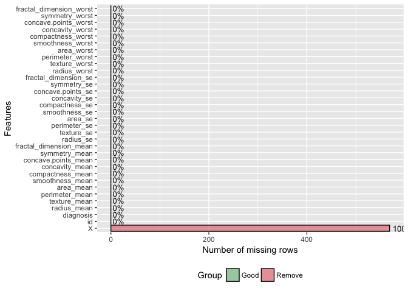
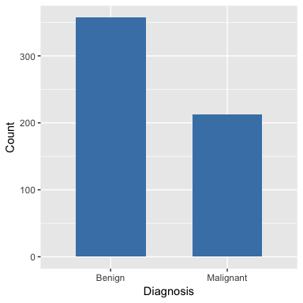
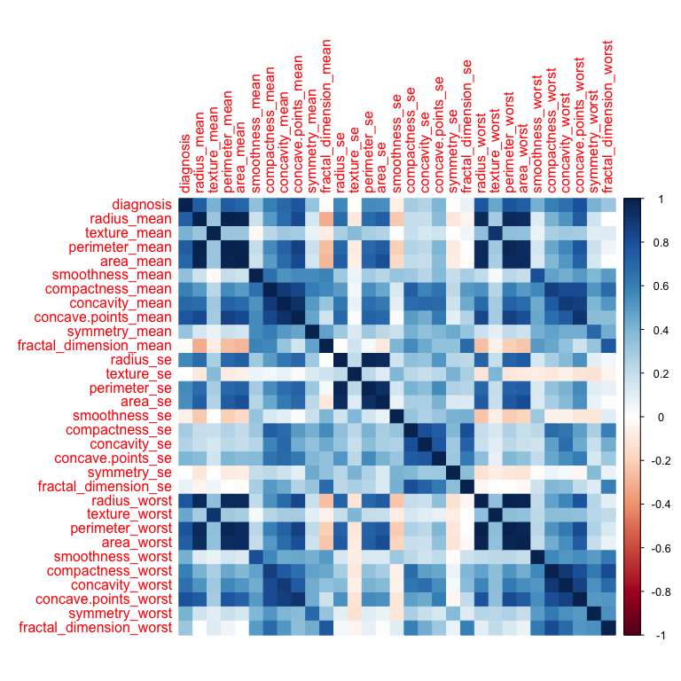

Breast FNA Biopsy Classification using Neural Network
================
NR

Breast cancer is one of the most common malignancies and can present as a breast mass. One of the many methods of diagnosis is a fine needle aspiration (FNA) biopsy of the mass. Analysis of the cellular elements of the aspiriate can help rule in or rule out a malignancy. The Breast Cancer Wisconsin (Diagnostic) Data Set (<https://archive.ics.uci.edu/ml/datasets/Breast+Cancer+Wisconsin+(Diagnostic)>) contains features of cell nuclei obtained from images of fine needle aspirates of breast masses. We will apply a neural network model to classify the mass as benign or malignant based on the characteristics of the nuclei of cells found in the aspirate.

We will use PyTorch, a Python package, via Reticulate. Reticulate enables use of Python functions and modules within R an interaoperability between R and Python objects. In this example, I will perform all data processing and analysis in R and use PyTorch to create and train a model.

Import and Preprocess data
--------------------------

#### Libraries/packages

R packages

``` r
library(reticulate)
use_python(python_dir) # Insert your python location
library(DataExplorer)
library(dplyr)
library(ggplot2)
library(pROC)
library(corrplot)
```

Python libraries

``` python
import torch
from torch.utils.data import TensorDataset, DataLoader
from torch import nn, optim
```

<br>

#### Import data from csv

``` r
data <- read.csv('data.csv', header = T)
head(data)
```

    ##         id diagnosis radius_mean texture_mean perimeter_mean area_mean
    ## 1   842302         M       17.99        10.38         122.80    1001.0
    ## 2   842517         M       20.57        17.77         132.90    1326.0
    ## 3 84300903         M       19.69        21.25         130.00    1203.0
    ## 4 84348301         M       11.42        20.38          77.58     386.1
    ## 5 84358402         M       20.29        14.34         135.10    1297.0
    ## 6   843786         M       12.45        15.70          82.57     477.1
    ##   smoothness_mean compactness_mean concavity_mean concave.points_mean
    ## 1         0.11840          0.27760         0.3001             0.14710
    ## 2         0.08474          0.07864         0.0869             0.07017
    ## 3         0.10960          0.15990         0.1974             0.12790
    ## 4         0.14250          0.28390         0.2414             0.10520
    ## 5         0.10030          0.13280         0.1980             0.10430
    ## 6         0.12780          0.17000         0.1578             0.08089
    ##   symmetry_mean fractal_dimension_mean radius_se texture_se perimeter_se
    ## 1        0.2419                0.07871    1.0950     0.9053        8.589
    ## 2        0.1812                0.05667    0.5435     0.7339        3.398
    ## 3        0.2069                0.05999    0.7456     0.7869        4.585
    ## 4        0.2597                0.09744    0.4956     1.1560        3.445
    ## 5        0.1809                0.05883    0.7572     0.7813        5.438
    ## 6        0.2087                0.07613    0.3345     0.8902        2.217
    ##   area_se smoothness_se compactness_se concavity_se concave.points_se
    ## 1  153.40      0.006399        0.04904      0.05373           0.01587
    ## 2   74.08      0.005225        0.01308      0.01860           0.01340
    ## 3   94.03      0.006150        0.04006      0.03832           0.02058
    ## 4   27.23      0.009110        0.07458      0.05661           0.01867
    ## 5   94.44      0.011490        0.02461      0.05688           0.01885
    ## 6   27.19      0.007510        0.03345      0.03672           0.01137
    ##   symmetry_se fractal_dimension_se radius_worst texture_worst
    ## 1     0.03003             0.006193        25.38         17.33
    ## 2     0.01389             0.003532        24.99         23.41
    ## 3     0.02250             0.004571        23.57         25.53
    ## 4     0.05963             0.009208        14.91         26.50
    ## 5     0.01756             0.005115        22.54         16.67
    ## 6     0.02165             0.005082        15.47         23.75
    ##   perimeter_worst area_worst smoothness_worst compactness_worst
    ## 1          184.60     2019.0           0.1622            0.6656
    ## 2          158.80     1956.0           0.1238            0.1866
    ## 3          152.50     1709.0           0.1444            0.4245
    ## 4           98.87      567.7           0.2098            0.8663
    ## 5          152.20     1575.0           0.1374            0.2050
    ## 6          103.40      741.6           0.1791            0.5249
    ##   concavity_worst concave.points_worst symmetry_worst
    ## 1          0.7119               0.2654         0.4601
    ## 2          0.2416               0.1860         0.2750
    ## 3          0.4504               0.2430         0.3613
    ## 4          0.6869               0.2575         0.6638
    ## 5          0.4000               0.1625         0.2364
    ## 6          0.5355               0.1741         0.3985
    ##   fractal_dimension_worst  X
    ## 1                 0.11890 NA
    ## 2                 0.08902 NA
    ## 3                 0.08758 NA
    ## 4                 0.17300 NA
    ## 5                 0.07678 NA
    ## 6                 0.12440 NA

<br>

#### Missing values

``` r
plot_missing(data)
```



<br>

#### Preprocess

``` r
# Remove unneeded features or features with missing values  
data <- data %>% select(-c(X, id))

# Rename diagnosis levels
levels(data$diagnosis) <- c('Benign','Malignant')
```

<br>

#### Class distribution

``` r
ggplot(data, aes(x=diagnosis)) +
  geom_bar(stat = 'count', fill='steelblue', width=0.6) +
  labs(x='Diagnosis', y = 'Count')
```

 <br>

#### Heatmap of correlations

``` r
corrplot(cor(as.matrix(data%>%mutate(diagnosis=as.numeric(diagnosis)))), method = 'color')
```

 <br>

Neural network model
--------------------

#### Train/Test split

Because the dataset is small, we will apply an 80%/20% split. We will convert all data frames to matrices to ensure a simple conversion to numpy arrays for use in Python. In addition, we will modify the train and test labels to convert them to zero-based ordering used in Python.

``` r
# Set seed
set.seed(1)

# Convert labels to numbers
data$diagnosis = as.numeric(data$diagnosis)

# 80% - 20% split
split = 0.2
n <- nrow(data)

# Shuffle data
shuffled <- data[sample(n),]
train_indices <- (round(split*n)+1):n
test_indices <- 1:round(split*n)

# Shuffled train and test set
train <- shuffled[train_indices,]
test <- shuffled[test_indices,]

# Separate features from labels
train_features <- train %>% select(-diagnosis)
train_labels <- train %>% select(diagnosis) 
test_features <- test %>% select(-diagnosis)
test_labels <- test %>% select(diagnosis)

# Convert data frames to matrices and subtract 1 from labels for zero-based ordering
train_features <- data.matrix(train_features) 
train_labels <- data.matrix(train_labels) - 1
test_features <- data.matrix(test_features) 
test_labels <- data.matrix(test_labels) - 1
```

<br>

#### Convert features and labels for use in PyTorch

We will convert the train and test datasets into tensors and input them into a dataloader

``` python
#### Python Code
# Convert numpy arrays to tensors
train_features = torch.from_numpy(r.train_features.astype('float32'))
train_labels = torch.from_numpy(r.train_labels.astype('float32'))
test_features = torch.from_numpy(r.test_features.astype('float32'))
test_labels = torch.from_numpy(r.test_labels.astype('float32'))  
# Load data into pytorch dataloader
trainset = TensorDataset(train_features, train_labels)
train_loader = DataLoader(dataset=trainset, batch_size=20, shuffle=True)
testset = TensorDataset(test_features, test_labels)
test_loader = DataLoader(dataset=testset, batch_size=20, shuffle=False)
```

<br>

#### Create model

We will use a simple feed-forward neural network with a hidden layer of 100 units followed by a another hidden layer of 50 units and finally an output layer of 1 unit. We will use relu activation functions for the hidden layers and a sigmoid activation for the final output layer.

``` python
#### Python Code
# Set seed
torch.manual_seed(1)
# Set device type
device = torch.device('cuda:0' if torch.cuda.is_available() else 'cpu') 
# Network
class net(nn.Module):
    def __init__(self):
        super(net, self).__init__()
        self.fc1 = torch.nn.Linear(30, 100)
        self.fc2 = torch.nn.Linear(100, 50)
        self.fc3 = torch.nn.Linear(50, 1)
        self.relu = torch.nn.ReLU()
        self.sigmoid = torch.nn.Sigmoid()
    def forward(self, x):
        x = self.relu(self.fc1(x))
        x = self.relu(self.fc2(x))
        x = self.sigmoid(self.fc3(x))
        return x
model = net()
```

<br>

#### Network Parameters

We will use the Adam optimizer with a learning rate of 0.001. Using a scheduler, we will apply a learning rate decay of 10% for every 100 epochs. Our loss function will be binary crossentropy.

``` python
#### Python Code
# Optimizer
optimizer = torch.optim.Adam(model.parameters(),lr=0.001)
# Decay
scheduler = torch.optim.lr_scheduler.StepLR(optimizer, step_size=100, gamma=0.1)
# Loss fxn
criterion = nn.BCELoss()
```

<br>

#### Train model

We will train the model for 200 epochs

``` python
#### Python Code
epochs = 200
# List of losses
train_losses=[]
test_losses=[]
for epoch in range(epochs):
  # Loop through train data
  model.train()
  train_loss=0
  train_corrects=0
  for features, labels in train_loader:
    features, labels = features.to(device), labels.to(device)
    optimizer.zero_grad()
    outputs = model(features)
    loss = criterion(outputs, labels)
    loss.backward()
    train_loss += loss.item()
    preds = torch.round(outputs)
    train_corrects += preds.eq(labels).sum().item()
    optimizer.step()
  train_acc = train_corrects/len(train_loader.dataset)
  train_loss = train_loss/len(train_loader)
  train_losses.append(train_loss)
  
  # Loop through test data
  model.eval()
  test_loss=0
  test_corrects=0
  with torch.no_grad():
    for features, labels in test_loader:
        features, labels = features.to(device), labels.to(device)
        outputs = model(features)
        loss = criterion(outputs, labels)
        test_loss += loss.item()
        preds = torch.round(outputs)
        test_corrects += preds.eq(labels).sum().item()
    test_acc = test_corrects/len(test_loader.dataset)
    test_loss = test_loss/len(test_loader)
    test_losses.append(test_loss)
  
  print("Epoch {:03d}: Loss: {:.3f}, Accuracy: {:.3%}, Test Loss: {:.3f}, Test Accuracy: {:.3%}".format(epoch + 1, train_loss, train_acc, test_loss, test_acc))
```

<br>

#### Training results:

    ## Epoch 200: Loss: 0.087, Accuracy: 96.044%, Test Loss: 0.139, Test Accuracy: 94.737%

``` r
# Plot of train and test losses over the 200 epochs
# Obtain train and test losses
train_losses <- py$train_losses
test_losses <- py$test_losses
epochs <- 1:length(train_losses)
loss <- data.frame(train_losses, test_losses, epochs)

# Plot train and test loss
ggplot(loss, aes(epochs)) + 
  geom_smooth(aes(y=train_losses, color='Train Loss'), method='loess', se=F) + 
  geom_smooth(aes(y=test_losses, color='Test Loss'), method='loess', se=F) +
  theme(legend.title = element_blank()) +
  labs(x='Epochs', y='Loss')
```

 <br>

Analysis of Results
-------------------

``` python
# Obtain predictions on test data
outputs = model(test_features)
preds = outputs.detach().numpy()
```

#### AUC

``` r
plot.roc(as.numeric(test_labels), as.numeric(py$preds), print.auc=T)
```


With our neural net classifier, we obtain a classification accuracy of 94.7% and an AUC of 0.98. Not bad!

<br> <br>

#### Advice for Improvement?

If you have any specific feedback, please let me know. I am looking to further improve my programming skills and would appreciate any advice.
