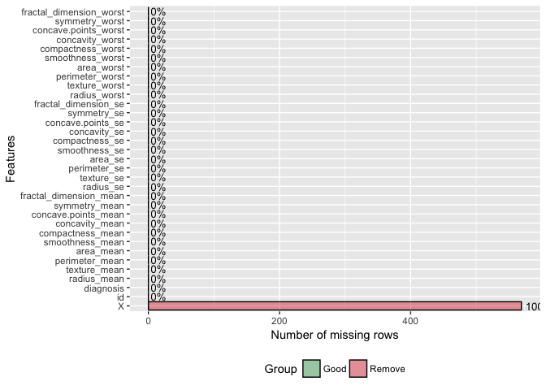
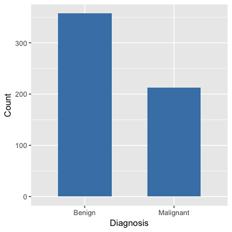
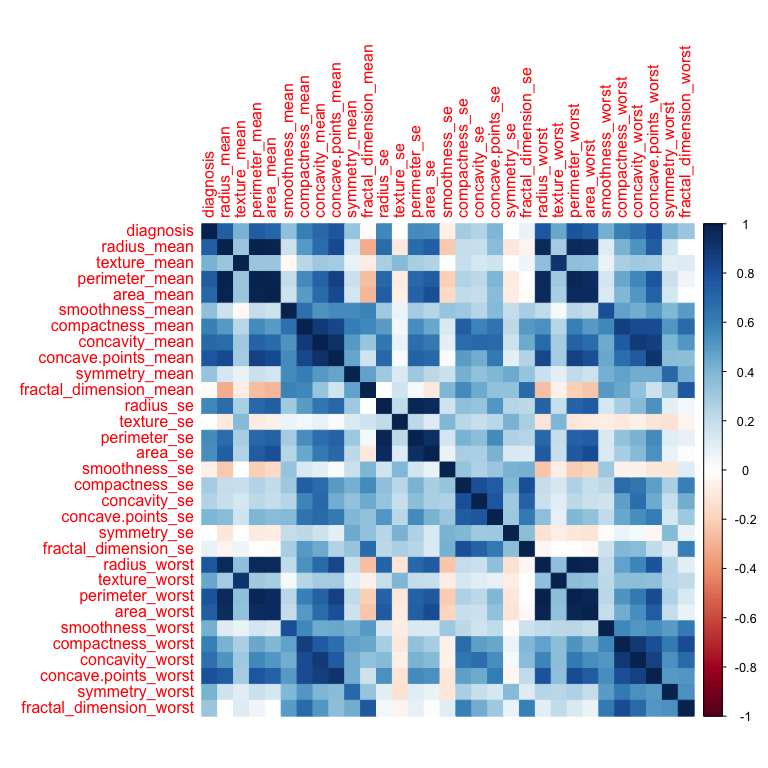
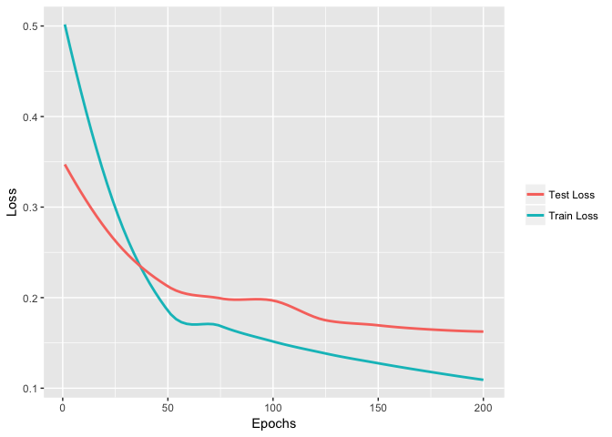
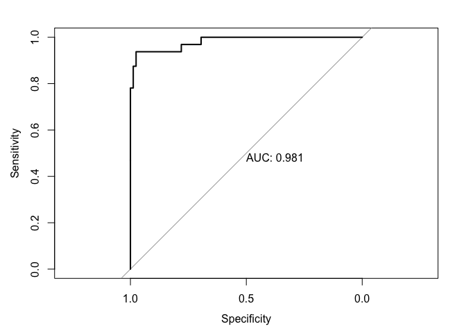

Breast cancer is one of the most common malignancies and can present as a breast mass. One of the many methods of diagnosis is a fine needle aspiration (FNA) biopsy of the mass. Analysis of the cellular elements of the aspiriate can help rule in or rule out a malignancy. The Breast Cancer Wisconsin (Diagnostic) Data Set (<https://archive.ics.uci.edu/ml/datasets/Breast+Cancer+Wisconsin+(Diagnostic)>) contains features of cell nuclei obtained from images of fine needle aspirates of breast masses. We will apply a neural network model to classify the mass as benign or malignant based on the characteristics of the nuclei of cells found in the aspirate.  

We will use PyTorch, a Python package, via Reticulate. Reticulate enables use of Python functions and modules within R an interaoperability between R and Python objects. In this example, I will perform all data processing and analysis in R and use PyTorch to create and train a model.  

## Import and Preprocess data  
#### Libraries/packages


R packages

```r
library(reticulate)
use_python(python_dir) # Insert your python location
library(DataExplorer)
library(dplyr)
library(ggplot2)
library(pROC)
library(corrplot)
```

Python libraries

```python
import torch
from torch.utils.data import TensorDataset, DataLoader
from torch import nn, optim
```
<br>

#### Import data from csv

```r
data <- read.csv('data.csv', header = T)
head(data)
```

<div data-pagedtable="false">
  <script data-pagedtable-source type="application/json">
{"columns":[{"label":[""],"name":["_rn_"],"type":[""],"align":["left"]},{"label":["id"],"name":[1],"type":["int"],"align":["right"]},{"label":["diagnosis"],"name":[2],"type":["fctr"],"align":["left"]},{"label":["radius_mean"],"name":[3],"type":["dbl"],"align":["right"]},{"label":["texture_mean"],"name":[4],"type":["dbl"],"align":["right"]},{"label":["perimeter_mean"],"name":[5],"type":["dbl"],"align":["right"]},{"label":["area_mean"],"name":[6],"type":["dbl"],"align":["right"]},{"label":["smoothness_mean"],"name":[7],"type":["dbl"],"align":["right"]},{"label":["compactness_mean"],"name":[8],"type":["dbl"],"align":["right"]},{"label":["concavity_mean"],"name":[9],"type":["dbl"],"align":["right"]},{"label":["concave.points_mean"],"name":[10],"type":["dbl"],"align":["right"]},{"label":["symmetry_mean"],"name":[11],"type":["dbl"],"align":["right"]},{"label":["fractal_dimension_mean"],"name":[12],"type":["dbl"],"align":["right"]},{"label":["radius_se"],"name":[13],"type":["dbl"],"align":["right"]},{"label":["texture_se"],"name":[14],"type":["dbl"],"align":["right"]},{"label":["perimeter_se"],"name":[15],"type":["dbl"],"align":["right"]},{"label":["area_se"],"name":[16],"type":["dbl"],"align":["right"]},{"label":["smoothness_se"],"name":[17],"type":["dbl"],"align":["right"]},{"label":["compactness_se"],"name":[18],"type":["dbl"],"align":["right"]},{"label":["concavity_se"],"name":[19],"type":["dbl"],"align":["right"]},{"label":["concave.points_se"],"name":[20],"type":["dbl"],"align":["right"]},{"label":["symmetry_se"],"name":[21],"type":["dbl"],"align":["right"]},{"label":["fractal_dimension_se"],"name":[22],"type":["dbl"],"align":["right"]},{"label":["radius_worst"],"name":[23],"type":["dbl"],"align":["right"]},{"label":["texture_worst"],"name":[24],"type":["dbl"],"align":["right"]},{"label":["perimeter_worst"],"name":[25],"type":["dbl"],"align":["right"]},{"label":["area_worst"],"name":[26],"type":["dbl"],"align":["right"]},{"label":["smoothness_worst"],"name":[27],"type":["dbl"],"align":["right"]},{"label":["compactness_worst"],"name":[28],"type":["dbl"],"align":["right"]},{"label":["concavity_worst"],"name":[29],"type":["dbl"],"align":["right"]},{"label":["concave.points_worst"],"name":[30],"type":["dbl"],"align":["right"]},{"label":["symmetry_worst"],"name":[31],"type":["dbl"],"align":["right"]},{"label":["fractal_dimension_worst"],"name":[32],"type":["dbl"],"align":["right"]},{"label":["X"],"name":[33],"type":["lgl"],"align":["right"]}],"data":[{"1":"842302","2":"M","3":"17.99","4":"10.38","5":"122.80","6":"1001.0","7":"0.11840","8":"0.27760","9":"0.3001","10":"0.14710","11":"0.2419","12":"0.07871","13":"1.0950","14":"0.9053","15":"8.589","16":"153.40","17":"0.006399","18":"0.04904","19":"0.05373","20":"0.01587","21":"0.03003","22":"0.006193","23":"25.38","24":"17.33","25":"184.60","26":"2019.0","27":"0.1622","28":"0.6656","29":"0.7119","30":"0.2654","31":"0.4601","32":"0.11890","33":"NA","_rn_":"1"},{"1":"842517","2":"M","3":"20.57","4":"17.77","5":"132.90","6":"1326.0","7":"0.08474","8":"0.07864","9":"0.0869","10":"0.07017","11":"0.1812","12":"0.05667","13":"0.5435","14":"0.7339","15":"3.398","16":"74.08","17":"0.005225","18":"0.01308","19":"0.01860","20":"0.01340","21":"0.01389","22":"0.003532","23":"24.99","24":"23.41","25":"158.80","26":"1956.0","27":"0.1238","28":"0.1866","29":"0.2416","30":"0.1860","31":"0.2750","32":"0.08902","33":"NA","_rn_":"2"},{"1":"84300903","2":"M","3":"19.69","4":"21.25","5":"130.00","6":"1203.0","7":"0.10960","8":"0.15990","9":"0.1974","10":"0.12790","11":"0.2069","12":"0.05999","13":"0.7456","14":"0.7869","15":"4.585","16":"94.03","17":"0.006150","18":"0.04006","19":"0.03832","20":"0.02058","21":"0.02250","22":"0.004571","23":"23.57","24":"25.53","25":"152.50","26":"1709.0","27":"0.1444","28":"0.4245","29":"0.4504","30":"0.2430","31":"0.3613","32":"0.08758","33":"NA","_rn_":"3"},{"1":"84348301","2":"M","3":"11.42","4":"20.38","5":"77.58","6":"386.1","7":"0.14250","8":"0.28390","9":"0.2414","10":"0.10520","11":"0.2597","12":"0.09744","13":"0.4956","14":"1.1560","15":"3.445","16":"27.23","17":"0.009110","18":"0.07458","19":"0.05661","20":"0.01867","21":"0.05963","22":"0.009208","23":"14.91","24":"26.50","25":"98.87","26":"567.7","27":"0.2098","28":"0.8663","29":"0.6869","30":"0.2575","31":"0.6638","32":"0.17300","33":"NA","_rn_":"4"},{"1":"84358402","2":"M","3":"20.29","4":"14.34","5":"135.10","6":"1297.0","7":"0.10030","8":"0.13280","9":"0.1980","10":"0.10430","11":"0.1809","12":"0.05883","13":"0.7572","14":"0.7813","15":"5.438","16":"94.44","17":"0.011490","18":"0.02461","19":"0.05688","20":"0.01885","21":"0.01756","22":"0.005115","23":"22.54","24":"16.67","25":"152.20","26":"1575.0","27":"0.1374","28":"0.2050","29":"0.4000","30":"0.1625","31":"0.2364","32":"0.07678","33":"NA","_rn_":"5"},{"1":"843786","2":"M","3":"12.45","4":"15.70","5":"82.57","6":"477.1","7":"0.12780","8":"0.17000","9":"0.1578","10":"0.08089","11":"0.2087","12":"0.07613","13":"0.3345","14":"0.8902","15":"2.217","16":"27.19","17":"0.007510","18":"0.03345","19":"0.03672","20":"0.01137","21":"0.02165","22":"0.005082","23":"15.47","24":"23.75","25":"103.40","26":"741.6","27":"0.1791","28":"0.5249","29":"0.5355","30":"0.1741","31":"0.3985","32":"0.12440","33":"NA","_rn_":"6"}],"options":{"columns":{"min":{},"max":[10]},"rows":{"min":[10],"max":[10]},"pages":{}}}
  </script>
</div>
<br>

#### Missing values

```r
plot_missing(data)
```

<!-- -->


<br>

#### Preprocess

```r
# Remove unneeded features or features with missing values  
data <- data %>% select(-c(X, id))

# Rename diagnosis levels
levels(data$diagnosis) <- c('Benign','Malignant')
```
<br>

#### Class distribution

```r
ggplot(data, aes(x=diagnosis)) +
  geom_bar(stat = 'count', fill='steelblue', width=0.6) +
  labs(x='Diagnosis', y = 'Count')
```

<!-- -->
<br>

#### Heatmap of correlations

```r
corrplot(cor(as.matrix(data%>%mutate(diagnosis=as.numeric(diagnosis)))), method = 'color')
```

<!-- -->
<br>

## Neural network model  
#### Train/Test split
Because the dataset is small, we will apply an 80%/20% split. We will convert all data frames to matrices to ensure a simple conversion to numpy arrays for use in Python. In addition, we will modify the train and test labels to convert them to zero-based ordering used in Python.

```r
# Set seed
set.seed(1)

# Convert labels to numbers
data$diagnosis = as.numeric(data$diagnosis)

# 80% - 20% split
split = 0.2
n <- nrow(data)

# Shuffle data
shuffled <- data[sample(n),]
train_indices <- (round(split*n)+1):n
test_indices <- 1:round(split*n)

# Shuffled train and test set
train <- shuffled[train_indices,]
test <- shuffled[test_indices,]

# Separate features from labels
train_features <- train %>% select(-diagnosis)
train_labels <- train %>% select(diagnosis) 
test_features <- test %>% select(-diagnosis)
test_labels <- test %>% select(diagnosis)

# Convert data frames to matrices and subtract 1 from labels for zero-based ordering
train_features <- data.matrix(train_features) 
train_labels <- data.matrix(train_labels) - 1
test_features <- data.matrix(test_features) 
test_labels <- data.matrix(test_labels) - 1
```

<br>

#### Convert features and labels for use in PyTorch  
We will convert the train and test datasets into tensors and input them into a dataloader

```python
#### Python Code
# Convert numpy arrays to tensors
train_features = torch.from_numpy(r.train_features.astype('float32'))
train_labels = torch.from_numpy(r.train_labels.astype('float32'))
test_features = torch.from_numpy(r.test_features.astype('float32'))
test_labels = torch.from_numpy(r.test_labels.astype('float32'))  
# Load data into pytorch dataloader
trainset = TensorDataset(train_features, train_labels)
train_loader = DataLoader(dataset=trainset, batch_size=20, shuffle=True)
testset = TensorDataset(test_features, test_labels)
test_loader = DataLoader(dataset=testset, batch_size=20, shuffle=False)
```
<br>

#### Create model
We will use a simple feed-forward neural network with a hidden layer of 100 units followed by a another hidden layer of 50 units and finally an output layer of 1 unit. We will use relu activation functions for the hidden layers and a sigmoid activation for the final output layer.

```python
#### Python Code
# Set seed
torch.manual_seed(1)
# Set device type
device = torch.device('cuda:0' if torch.cuda.is_available() else 'cpu') 
# Network
class net(nn.Module):
    def __init__(self):
        super(net, self).__init__()
        self.fc1 = torch.nn.Linear(30, 100)
        self.fc2 = torch.nn.Linear(100, 50)
        self.fc3 = torch.nn.Linear(50, 1)
        self.relu = torch.nn.ReLU()
        self.sigmoid = torch.nn.Sigmoid()
    def forward(self, x):
        x = self.relu(self.fc1(x))
        x = self.relu(self.fc2(x))
        x = self.sigmoid(self.fc3(x))
        return x
model = net()
```
<br>

#### Network Parameters
We will use the Adam optimizer with a learning rate of 0.001. Using a scheduler, we will apply a learning rate decay of 10% for every 100 epochs. Our loss function will be binary crossentropy.

```python
#### Python Code
# Optimizer
optimizer = torch.optim.Adam(model.parameters(),lr=0.001)
# Decay
scheduler = torch.optim.lr_scheduler.StepLR(optimizer, step_size=100, gamma=0.1)
# Loss fxn
criterion = nn.BCELoss()
```

<br>

#### Train model
We will train the model for 200 epochs

```python
#### Python Code
epochs = 200
# List of losses
train_losses=[]
test_losses=[]
for epoch in range(epochs):
  # Loop through train data
  model.train()
  train_loss=0
  train_corrects=0
  for features, labels in train_loader:
    features, labels = features.to(device), labels.to(device)
    optimizer.zero_grad()
    outputs = model(features)
    loss = criterion(outputs, labels)
    loss.backward()
    train_loss += loss.item()
    preds = torch.round(outputs)
    train_corrects += preds.eq(labels).sum().item()
    optimizer.step()
  train_acc = train_corrects/len(train_loader.dataset)
  train_loss = train_loss/len(train_loader)
  train_losses.append(train_loss)
  
  # Loop through test data
  model.eval()
  test_loss=0
  test_corrects=0
  with torch.no_grad():
    for features, labels in test_loader:
        features, labels = features.to(device), labels.to(device)
        outputs = model(features)
        loss = criterion(outputs, labels)
        test_loss += loss.item()
        preds = torch.round(outputs)
        test_corrects += preds.eq(labels).sum().item()
    test_acc = test_corrects/len(test_loader.dataset)
    test_loss = test_loss/len(test_loader)
    test_losses.append(test_loss)
  
  print("Epoch {:03d}: Loss: {:.3f}, Accuracy: {:.3%}, Test Loss: {:.3f}, Test Accuracy: {:.3%}".format(epoch + 1, train_loss, train_acc, test_loss, test_acc))
```
<br>

#### Training results:

```
## Epoch 200: Loss: 0.085, Accuracy: 96.044%, Test Loss: 0.144, Test Accuracy: 94.737%
```


```r
# Plot of train and test losses over the 200 epochs
# Obtain train and test losses
train_losses <- py$train_losses
test_losses <- py$test_losses
epochs <- 1:length(train_losses)
loss <- data.frame(train_losses, test_losses, epochs)

# Plot train and test loss
ggplot(loss, aes(epochs)) + 
  geom_smooth(aes(y=train_losses, color='Train Loss'), method='loess', se=F) + 
  geom_smooth(aes(y=test_losses, color='Test Loss'), method='loess', se=F) +
  theme(legend.title = element_blank()) +
  labs(x='Epochs', y='Loss')
```

<!-- -->
<br>

## Analysis of Results  

```python
# Obtain predictions on test data
outputs = model(test_features)
preds = outputs.detach().numpy()
```

#### AUC

```r
plot.roc(as.numeric(test_labels), as.numeric(py$preds), print.auc=T)
```

<!-- -->


With our neural net classifier, we obtain a classification accuracy of 94.7% and an AUC of 0.98. Not bad!

<br>
<br>

#### Advice for Improvement?    
If you have any specific feedback, please let me know. I am looking to further improve my programming skills and would appreciate any advice.
