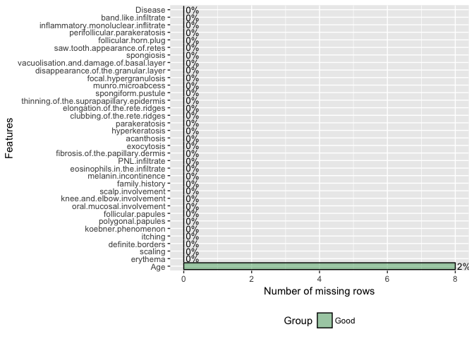
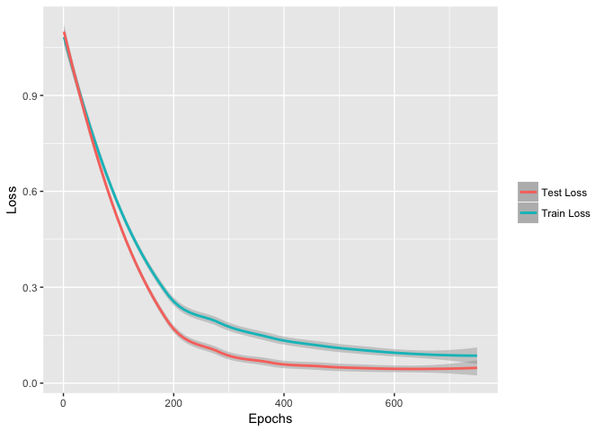

In this repo, I will demonstrate how embeddings can be used to explore and visualize relationships between categorical variables. The idea of applying embeddings to categorical data was suggested by Guo and Berkhahn (<https://arxiv.org/abs/1604.06737>). I was first introduced to the idea while watching the Fast.ai course lectures (<http://www.fast.ai/>), which I recommend to anyone interested in deep learning. 

### What are categorical embeddings?  
Embeddings are representations of a piece of data projected to a n-dimensional space. In the case of categorical embeddings, we are projecting a categorical vector to a lower dimension representation. Traditionally, categorical variables are encoded as independent variables using a method known as one-hot-encoding. Unlike one-hot-encoding, categorical embeddings offer the advantage of being able to capture intricate relationships between the different categories within each feature.  

### Dataset
We will generate categorical embeddings for the features in the Dermatology Data Set in the UCI Machine Learning Repo. This dataset consists of 366 cases of erythemato-squamous diseases, which often share several similarities particularly on histopathology. There are 6 disease categories: psoriasis, seborrheic dermatitis, lichen planus, pityriasis rosea, chronic dermatitis, and pityriasis rubra pilaris. The dataset looks at 34 features - 11 clinical features (i.e. age, presence of itching, location on body) and 22 histopathological features of tissue biopsy samples seen on microscopy. For more information on the dataset, check out <https://archive.ics.uci.edu/ml/datasets/dermatology>. 

We will be using R and PyTorch (via the Reticulate R package: <https://rstudio.github.io/reticulate/>) for this project. 


### Import useful libraries/packages


R packages:

```r
library(reticulate)
use_python(python_dir) # Insert location to python
library(DataExplorer)
library(dplyr)
library(ggplot2)
library(plotly)
```

Python libraries:

```python
import torch
from torch.utils.data import TensorDataset, DataLoader
from torch import nn, optim
```


## Load and preprocess the data

The data is stored in a csv file. Unfortunately, the names of the features are not in the file but are listed on the website. I have provided a modified csv with the appropriate column names.

```r
# Load data, question marks are interpreted as missing values
data <- read.csv('dermatology.csv', header=T, na.strings = '?') 
head(data)
```


```r
plot_missing(data)
```

<!-- -->


It appears **Age** has some missing variables - let's drop this feature. We will also drop **family.history** since the majority of the cases have no family history.

```r
# Drop age and family history
data <- data %>% select(-c(Age, family.history))
```

<br>
Now we are finished preprocessing our dataset. We will split the data into a train (80%) and test set (20%). We will also separate the features (x) from the label (y). We have 6 label classes (1 through 6), but because python uses zero-based-numbering, we will subtract 1 from the label vectors. We also obtain a list of the number of unique levels for each feature which we will use for creation of the embeddings.

```r
# Set seed
set.seed(123)

# 80% - 20% split
split = 0.2
n <- nrow(data)

# Shuffle data
shuffled <- data[sample(n),]
train_indices <- (round(split*n)+1):n
test_indices <- 1:round(split*n)

# Shuffled train and test set
train <- shuffled[train_indices,]
test <- shuffled[test_indices,]

# Separate features from labels
train_x <- train %>% select(-Disease)
train_y <- train %>% select(Disease)
test_x <- test %>% select(-Disease)
test_y <- test %>% select(Disease)

# List of number of unique categories for each feature
cats <- data %>% select(-Disease) %>% lapply(as.factor) %>% lapply(nlevels) %>% as.integer

# Convert dataframe to matrices with zero-based ordering
train_x <- data.matrix(train_x) 
train_y <- data.matrix(train_y) - 1
test_x <- data.matrix(test_x) 
test_y <- data.matrix(test_y) - 1
```
<br>  

## Create a neural network classifier
Now we will create a neural network classifier consisting of 32 embeddings, one for each feature, followed by a fully connected layer and an output layer. Most of our features have 4 levels (0, 1, 2, and 3), so we will use an embedding size of 2 for each feature to keep it simple. Using PyTorch's ModuleList, we create an embedding for each feature. The embeddings are concatenated and serve as the input for the first fully connected layer. This is followed by a softmax layer consisting of 6 outputs corresponding to the 6 possible conditions.  

We will use Relu activation functions for each fully connected layer and softmax activation for the final output layer. We also use dropout on the penultimate layer to control overfitting. Our loss will be calculated using crossentropy. For training, we will use the SGD optimizer with a learning rate of 0.01. 


```python
#### Python code
# Set seed
torch.manual_seed(321)
# Set embedding size
embedding_size = 2
# Set device type
device = torch.device('cuda:0' if torch.cuda.is_available() else 'cpu')  
class model(nn.Module):
  def __init__(self,cats):
    super(model, self).__init__()
    # Create embedding for each feature
    self.embs = nn.ModuleList([nn.Embedding(k, embedding_size) for k in cats])
    self.fc1 = nn.Linear(64, 12)
    self.fc2 = nn.Linear(12, 6)
    self.relu = nn.ReLU()
    self.drop = nn.Dropout(0.2)
  def forward(self, x):
    # Input each feature into its respective embedding
    x = [embed(x[:,i]) for i, embed in enumerate(self.embs)]
    # Concatenate all embeddings
    x = torch.cat(x,-1)
    x = self.relu(self.fc1(x))
    x = self.drop(x)
    x = self.fc2(x)
    return x  
model = model(r.cats).to(device)  
# Loss function
loss_func = nn.CrossEntropyLoss()  
# Optimizer
optimizer = optim.SGD(model.parameters(), lr=0.01)
```


We will now proceed to load the data into a tensor dataset used by pytorch

```python
#### Python Code 
# Convert numpy arrays to tensors
x_train = torch.from_numpy(r.train_x.astype('int64'))
y_train = torch.from_numpy(r.train_y.astype('int64')).view(-1,)
x_test = torch.from_numpy(r.test_x.astype('int64'))
y_test = torch.from_numpy(r.test_y.astype('int64')).view(-1,)  
# Load data into pytorch dataloader
trainset = TensorDataset(x_train, y_train)
train_loader = DataLoader(dataset=trainset, batch_size=32, shuffle=True)
```


## Train the model 

We will train our classifier for 750 epochs

```python
#### Python code
epochs=750
train_losses=[]
test_losses=[]
for epoch in range(epochs):
  train_loss=0
  running_corrects=0
  # Training loop
  model.train()
  for features, labels in train_loader:
    features, labels = features.to(device), labels.to(device)
    optimizer.zero_grad()
    outputs = model(features)
    loss = loss_func(outputs, labels)
    loss.backward()
    train_loss += loss.item()
    preds = torch.max(outputs, 1)[1]
    running_corrects += preds.eq(labels).sum().item()
    optimizer.step()
  train_acc = running_corrects/len(train_loader.dataset)
  train_loss = train_loss/len(train_loader)
  train_losses.append(train_loss)
  
  # Evaluation loop
  model.eval()
  with torch.no_grad():
    features, labels = x_test, y_test
    features, labels = features.to(device), labels.to(device)
    outputs = model(features)
    loss = loss_func(outputs, labels)
    test_loss=loss.item()
    test_losses.append(test_loss)
    preds = torch.max(outputs, 1)[1]
    corrects = preds.eq(labels).sum().item()
    test_acc = corrects/len(x_test)
  print("Epoch {:03d}: Loss: {:.3f}, Accuracy: {:.3%}, Test Loss: {:.3f}, Test Accuracy: {:.3%}".format(epoch + 1, train_loss, train_acc, test_loss, test_acc))
```


#### Training Results:

```
## Epoch 750: Loss: 0.074, Accuracy: 98.294%, Test Loss: 0.039, Test Accuracy: 98.630%
```

<!-- -->


## Extract and visualize trained embeddings


```python
#### Python code
# obtain embedding weights
emb_weights = [embedding.weight.detach().numpy() for embedding in model.embs]
```

Currently, we have the embedding weights for each level of each feature. For visualization purposes, we will focus on features with a category of 3 (severe) and discard the other weights. We will incorporate the weights and feature labels into an R data frame, embed_data, and plot the results.


```r
head(embed_data)
```

<div data-pagedtable="false">
  <script data-pagedtable-source type="application/json">
{"columns":[{"label":[""],"name":["_rn_"],"type":[""],"align":["left"]},{"label":["Dim_1"],"name":[1],"type":["dbl"],"align":["right"]},{"label":["Dim_2"],"name":[2],"type":["dbl"],"align":["right"]},{"label":["Labels"],"name":[3],"type":["fctr"],"align":["left"]}],"data":[{"1":"-0.62775022","2":"-1.1986362","3":"erythema","_rn_":"1"},{"1":"0.07530504","2":"-0.1837743","3":"scaling","_rn_":"2"},{"1":"-0.61251748","2":"0.3172307","3":"definite.borders","_rn_":"3"},{"1":"0.14504303","2":"0.4625579","3":"itching","_rn_":"4"},{"1":"0.98426247","2":"0.5630311","3":"koebner.phenomenon","_rn_":"5"},{"1":"0.11390265","2":"0.5921493","3":"polygonal.papules","_rn_":"6"}],"options":{"columns":{"min":{},"max":[10]},"rows":{"min":[10],"max":[10]},"pages":{}}}
  </script>
</div>

<br>  

### Categorical embeddings for clinical and histopathological features:
<!--html_preserve--><div id="846e488604bc" style="width:672px;height:480px;" class="plotly html-widget"></div>
<script type="application/json" data-for="846e488604bc">{"x":{"data":[{"x":[-0.612517476081848],"y":[0.317230731248856],"text":"definite.borders","type":"scatter","mode":"markers","marker":{"autocolorscale":false,"color":"rgba(248,118,109,1)","opacity":0.8,"size":11.3385826771654,"symbol":"circle","line":{"width":1.88976377952756,"color":"rgba(248,118,109,1)"}},"hoveron":"points","name":"definite.borders","legendgroup":"definite.borders","showlegend":true,"xaxis":"x","yaxis":"y","hoverinfo":"text","frame":null},{"x":[-0.627750217914581],"y":[-1.19863617420197],"text":"erythema","type":"scatter","mode":"markers","marker":{"autocolorscale":false,"color":"rgba(216,144,0,1)","opacity":0.8,"size":11.3385826771654,"symbol":"circle","line":{"width":1.88976377952756,"color":"rgba(216,144,0,1)"}},"hoveron":"points","name":"erythema","legendgroup":"erythema","showlegend":true,"xaxis":"x","yaxis":"y","hoverinfo":"text","frame":null},{"x":[0.248099371790886],"y":[-0.053002055734396],"text":"follicular.papules","type":"scatter","mode":"markers","marker":{"autocolorscale":false,"color":"rgba(163,165,0,1)","opacity":0.8,"size":11.3385826771654,"symbol":"circle","line":{"width":1.88976377952756,"color":"rgba(163,165,0,1)"}},"hoveron":"points","name":"follicular.papules","legendgroup":"follicular.papules","showlegend":true,"xaxis":"x","yaxis":"y","hoverinfo":"text","frame":null},{"x":[0.145043030381203],"y":[0.462557852268219],"text":"itching","type":"scatter","mode":"markers","marker":{"autocolorscale":false,"color":"rgba(57,182,0,1)","opacity":0.8,"size":11.3385826771654,"symbol":"circle","line":{"width":1.88976377952756,"color":"rgba(57,182,0,1)"}},"hoveron":"points","name":"itching","legendgroup":"itching","showlegend":true,"xaxis":"x","yaxis":"y","hoverinfo":"text","frame":null},{"x":[-0.0733308121562004],"y":[-0.280422031879425],"text":"knee.and.elbow.involvement","type":"scatter","mode":"markers","marker":{"autocolorscale":false,"color":"rgba(0,191,125,1)","opacity":0.8,"size":11.3385826771654,"symbol":"circle","line":{"width":1.88976377952756,"color":"rgba(0,191,125,1)"}},"hoveron":"points","name":"knee.and.elbow.involvement","legendgroup":"knee.and.elbow.involvement","showlegend":true,"xaxis":"x","yaxis":"y","hoverinfo":"text","frame":null},{"x":[0.984262466430664],"y":[0.563031136989594],"text":"koebner.phenomenon","type":"scatter","mode":"markers","marker":{"autocolorscale":false,"color":"rgba(0,191,196,1)","opacity":0.8,"size":11.3385826771654,"symbol":"circle","line":{"width":1.88976377952756,"color":"rgba(0,191,196,1)"}},"hoveron":"points","name":"koebner.phenomenon","legendgroup":"koebner.phenomenon","showlegend":true,"xaxis":"x","yaxis":"y","hoverinfo":"text","frame":null},{"x":[-0.903903424739838],"y":[0.622461915016174],"text":"oral.mucosal.involvement","type":"scatter","mode":"markers","marker":{"autocolorscale":false,"color":"rgba(0,176,246,1)","opacity":0.8,"size":11.3385826771654,"symbol":"circle","line":{"width":1.88976377952756,"color":"rgba(0,176,246,1)"}},"hoveron":"points","name":"oral.mucosal.involvement","legendgroup":"oral.mucosal.involvement","showlegend":true,"xaxis":"x","yaxis":"y","hoverinfo":"text","frame":null},{"x":[0.113902650773525],"y":[0.592149257659912],"text":"polygonal.papules","type":"scatter","mode":"markers","marker":{"autocolorscale":false,"color":"rgba(149,144,255,1)","opacity":0.8,"size":11.3385826771654,"symbol":"circle","line":{"width":1.88976377952756,"color":"rgba(149,144,255,1)"}},"hoveron":"points","name":"polygonal.papules","legendgroup":"polygonal.papules","showlegend":true,"xaxis":"x","yaxis":"y","hoverinfo":"text","frame":null},{"x":[0.0753050446510315],"y":[-0.183774292469025],"text":"scaling","type":"scatter","mode":"markers","marker":{"autocolorscale":false,"color":"rgba(231,107,243,1)","opacity":0.8,"size":11.3385826771654,"symbol":"circle","line":{"width":1.88976377952756,"color":"rgba(231,107,243,1)"}},"hoveron":"points","name":"scaling","legendgroup":"scaling","showlegend":true,"xaxis":"x","yaxis":"y","hoverinfo":"text","frame":null},{"x":[0.637070953845978],"y":[-0.654565632343292],"text":"scalp.involvement","type":"scatter","mode":"markers","marker":{"autocolorscale":false,"color":"rgba(255,98,188,1)","opacity":0.8,"size":11.3385826771654,"symbol":"circle","line":{"width":1.88976377952756,"color":"rgba(255,98,188,1)"}},"hoveron":"points","name":"scalp.involvement","legendgroup":"scalp.involvement","showlegend":true,"xaxis":"x","yaxis":"y","hoverinfo":"text","frame":null}],"layout":{"margin":{"t":43.7625570776256,"r":7.30593607305936,"b":25.5707762557078,"l":34.337899543379},"plot_bgcolor":"rgba(235,235,235,1)","paper_bgcolor":"rgba(255,255,255,1)","font":{"color":"rgba(0,0,0,1)","family":"","size":14.6118721461187},"title":"Clinical Feature Embeddings","titlefont":{"color":"rgba(0,0,0,1)","family":"","size":17.5342465753425},"xaxis":{"domain":[0,1],"type":"linear","autorange":false,"tickmode":"array","range":[-0.998311719298363,1.07867076098919],"ticktext":["-0.5","0.0","0.5","1.0"],"tickvals":[-0.5,0,0.5,1],"ticks":"outside","tickcolor":"rgba(51,51,51,1)","ticklen":3.65296803652968,"tickwidth":0.66417600664176,"showticklabels":true,"tickfont":{"color":"rgba(77,77,77,1)","family":"","size":11.689497716895},"tickangle":-0,"showline":false,"linecolor":null,"linewidth":0,"showgrid":true,"gridcolor":"rgba(255,255,255,1)","gridwidth":0.66417600664176,"zeroline":false,"anchor":"y","title":"","titlefont":{"color":"rgba(0,0,0,1)","family":"","size":14.6118721461187},"hoverformat":".2f"},"yaxis":{"domain":[0,1],"type":"linear","autorange":false,"tickmode":"array","range":[-1.28969107866287,0.713516819477081],"ticktext":["-1.0","-0.5","0.0","0.5"],"tickvals":[-1,-0.5,0,0.5],"ticks":"outside","tickcolor":"rgba(51,51,51,1)","ticklen":3.65296803652968,"tickwidth":0.66417600664176,"showticklabels":true,"tickfont":{"color":"rgba(77,77,77,1)","family":"","size":11.689497716895},"tickangle":-0,"showline":false,"linecolor":null,"linewidth":0,"showgrid":true,"gridcolor":"rgba(255,255,255,1)","gridwidth":0.66417600664176,"zeroline":false,"anchor":"x","title":"","titlefont":{"color":"rgba(0,0,0,1)","family":"","size":14.6118721461187},"hoverformat":".2f"},"shapes":[{"type":"rect","fillcolor":null,"line":{"color":null,"width":0,"linetype":[]},"yref":"paper","xref":"paper","x0":0,"x1":1,"y0":0,"y1":1}],"showlegend":false,"legend":{"bgcolor":"rgba(255,255,255,1)","bordercolor":"transparent","borderwidth":1.88976377952756,"font":{"color":"rgba(0,0,0,1)","family":"","size":11.689497716895}},"hovermode":"compare"},"source":"A","attrs":{"846e7cfb168e":{"x":{},"y":{},"colour":{},"text":{},"type":"ggplotly"}},"cur_data":"846e7cfb168e","visdat":{"846e7cfb168e":["function (y) ","x"]},"config":{"modeBarButtonsToAdd":[{"name":"Collaborate","icon":{"width":1000,"ascent":500,"descent":-50,"path":"M487 375c7-10 9-23 5-36l-79-259c-3-12-11-23-22-31-11-8-22-12-35-12l-263 0c-15 0-29 5-43 15-13 10-23 23-28 37-5 13-5 25-1 37 0 0 0 3 1 7 1 5 1 8 1 11 0 2 0 4-1 6 0 3-1 5-1 6 1 2 2 4 3 6 1 2 2 4 4 6 2 3 4 5 5 7 5 7 9 16 13 26 4 10 7 19 9 26 0 2 0 5 0 9-1 4-1 6 0 8 0 2 2 5 4 8 3 3 5 5 5 7 4 6 8 15 12 26 4 11 7 19 7 26 1 1 0 4 0 9-1 4-1 7 0 8 1 2 3 5 6 8 4 4 6 6 6 7 4 5 8 13 13 24 4 11 7 20 7 28 1 1 0 4 0 7-1 3-1 6-1 7 0 2 1 4 3 6 1 1 3 4 5 6 2 3 3 5 5 6 1 2 3 5 4 9 2 3 3 7 5 10 1 3 2 6 4 10 2 4 4 7 6 9 2 3 4 5 7 7 3 2 7 3 11 3 3 0 8 0 13-1l0-1c7 2 12 2 14 2l218 0c14 0 25-5 32-16 8-10 10-23 6-37l-79-259c-7-22-13-37-20-43-7-7-19-10-37-10l-248 0c-5 0-9-2-11-5-2-3-2-7 0-12 4-13 18-20 41-20l264 0c5 0 10 2 16 5 5 3 8 6 10 11l85 282c2 5 2 10 2 17 7-3 13-7 17-13z m-304 0c-1-3-1-5 0-7 1-1 3-2 6-2l174 0c2 0 4 1 7 2 2 2 4 4 5 7l6 18c0 3 0 5-1 7-1 1-3 2-6 2l-173 0c-3 0-5-1-8-2-2-2-4-4-4-7z m-24-73c-1-3-1-5 0-7 2-2 3-2 6-2l174 0c2 0 5 0 7 2 3 2 4 4 5 7l6 18c1 2 0 5-1 6-1 2-3 3-5 3l-174 0c-3 0-5-1-7-3-3-1-4-4-5-6z"},"click":"function(gd) { \n        // is this being viewed in RStudio?\n        if (location.search == '?viewer_pane=1') {\n          alert('To learn about plotly for collaboration, visit:\\n https://cpsievert.github.io/plotly_book/plot-ly-for-collaboration.html');\n        } else {\n          window.open('https://cpsievert.github.io/plotly_book/plot-ly-for-collaboration.html', '_blank');\n        }\n      }"}],"cloud":false},"highlight":{"on":"plotly_click","persistent":false,"dynamic":false,"selectize":false,"opacityDim":0.2,"selected":{"opacity":1}},"base_url":"https://plot.ly"},"evals":["config.modeBarButtonsToAdd.0.click"],"jsHooks":{"render":[{"code":"function(el, x) { var ctConfig = crosstalk.var('plotlyCrosstalkOpts').set({\"on\":\"plotly_click\",\"persistent\":false,\"dynamic\":false,\"selectize\":false,\"opacityDim\":0.2,\"selected\":{\"opacity\":1}}); }","data":null}]}}</script><!--/html_preserve--><!--html_preserve--><div id="846e504fe27" style="width:672px;height:480px;" class="plotly html-widget"></div>
<script type="application/json" data-for="846e504fe27">{"x":{"data":[{"x":[-0.92480480670929],"y":[1.97735774517059],"text":"acanthosis","type":"scatter","mode":"markers","marker":{"autocolorscale":false,"color":"rgba(248,118,109,1)","opacity":0.8,"size":11.3385826771654,"symbol":"circle","line":{"width":1.88976377952756,"color":"rgba(248,118,109,1)"}},"hoveron":"points","name":"acanthosis","legendgroup":"acanthosis","showlegend":true,"xaxis":"x","yaxis":"y","hoverinfo":"text","frame":null},{"x":[0.52742201089859],"y":[-0.0173469614237547],"text":"band.like.infiltrate","type":"scatter","mode":"markers","marker":{"autocolorscale":false,"color":"rgba(235,131,53,1)","opacity":0.8,"size":11.3385826771654,"symbol":"circle","line":{"width":1.88976377952756,"color":"rgba(235,131,53,1)"}},"hoveron":"points","name":"band.like.infiltrate","legendgroup":"band.like.infiltrate","showlegend":true,"xaxis":"x","yaxis":"y","hoverinfo":"text","frame":null},{"x":[-0.93813943862915],"y":[-0.858902335166931],"text":"clubbing.of.the.rete.ridges","type":"scatter","mode":"markers","marker":{"autocolorscale":false,"color":"rgba(218,143,0,1)","opacity":0.8,"size":11.3385826771654,"symbol":"circle","line":{"width":1.88976377952756,"color":"rgba(218,143,0,1)"}},"hoveron":"points","name":"clubbing.of.the.rete.ridges","legendgroup":"clubbing.of.the.rete.ridges","showlegend":true,"xaxis":"x","yaxis":"y","hoverinfo":"text","frame":null},{"x":[-0.425472885370255],"y":[0.79607617855072],"text":"disappearance.of.the.granular.layer","type":"scatter","mode":"markers","marker":{"autocolorscale":false,"color":"rgba(196,154,0,1)","opacity":0.8,"size":11.3385826771654,"symbol":"circle","line":{"width":1.88976377952756,"color":"rgba(196,154,0,1)"}},"hoveron":"points","name":"disappearance.of.the.granular.layer","legendgroup":"disappearance.of.the.granular.layer","showlegend":true,"xaxis":"x","yaxis":"y","hoverinfo":"text","frame":null},{"x":[-0.554160714149475],"y":[-1.49656224250793],"text":"elongation.of.the.rete.ridges","type":"scatter","mode":"markers","marker":{"autocolorscale":false,"color":"rgba(169,164,0,1)","opacity":0.8,"size":11.3385826771654,"symbol":"circle","line":{"width":1.88976377952756,"color":"rgba(169,164,0,1)"}},"hoveron":"points","name":"elongation.of.the.rete.ridges","legendgroup":"elongation.of.the.rete.ridges","showlegend":true,"xaxis":"x","yaxis":"y","hoverinfo":"text","frame":null},{"x":[-0.35607898235321],"y":[-0.77222728729248],"text":"exocytosis","type":"scatter","mode":"markers","marker":{"autocolorscale":false,"color":"rgba(134,172,0,1)","opacity":0.8,"size":11.3385826771654,"symbol":"circle","line":{"width":1.88976377952756,"color":"rgba(134,172,0,1)"}},"hoveron":"points","name":"exocytosis","legendgroup":"exocytosis","showlegend":true,"xaxis":"x","yaxis":"y","hoverinfo":"text","frame":null},{"x":[-1.46633207798004],"y":[-0.655742883682251],"text":"fibrosis.of.the.papillary.dermis","type":"scatter","mode":"markers","marker":{"autocolorscale":false,"color":"rgba(83,180,0,1)","opacity":0.8,"size":11.3385826771654,"symbol":"circle","line":{"width":1.88976377952756,"color":"rgba(83,180,0,1)"}},"hoveron":"points","name":"fibrosis.of.the.papillary.dermis","legendgroup":"fibrosis.of.the.papillary.dermis","showlegend":true,"xaxis":"x","yaxis":"y","hoverinfo":"text","frame":null},{"x":[0.671598851680756],"y":[1.80284595489502],"text":"focal.hypergranulosis","type":"scatter","mode":"markers","marker":{"autocolorscale":false,"color":"rgba(0,186,56,1)","opacity":0.8,"size":11.3385826771654,"symbol":"circle","line":{"width":1.88976377952756,"color":"rgba(0,186,56,1)"}},"hoveron":"points","name":"focal.hypergranulosis","legendgroup":"focal.hypergranulosis","showlegend":true,"xaxis":"x","yaxis":"y","hoverinfo":"text","frame":null},{"x":[-0.133815139532089],"y":[0.107645288109779],"text":"follicular.horn.plug","type":"scatter","mode":"markers","marker":{"autocolorscale":false,"color":"rgba(0,190,109,1)","opacity":0.8,"size":11.3385826771654,"symbol":"circle","line":{"width":1.88976377952756,"color":"rgba(0,190,109,1)"}},"hoveron":"points","name":"follicular.horn.plug","legendgroup":"follicular.horn.plug","showlegend":true,"xaxis":"x","yaxis":"y","hoverinfo":"text","frame":null},{"x":[0.916552186012268],"y":[0.0215167365968227],"text":"hyperkeratosis","type":"scatter","mode":"markers","marker":{"autocolorscale":false,"color":"rgba(0,192,148,1)","opacity":0.8,"size":11.3385826771654,"symbol":"circle","line":{"width":1.88976377952756,"color":"rgba(0,192,148,1)"}},"hoveron":"points","name":"hyperkeratosis","legendgroup":"hyperkeratosis","showlegend":true,"xaxis":"x","yaxis":"y","hoverinfo":"text","frame":null},{"x":[-0.217012509703636],"y":[-1.50495231151581],"text":"inflammatory.monoluclear.inflitrate","type":"scatter","mode":"markers","marker":{"autocolorscale":false,"color":"rgba(0,192,181,1)","opacity":0.8,"size":11.3385826771654,"symbol":"circle","line":{"width":1.88976377952756,"color":"rgba(0,192,181,1)"}},"hoveron":"points","name":"inflammatory.monoluclear.inflitrate","legendgroup":"inflammatory.monoluclear.inflitrate","showlegend":true,"xaxis":"x","yaxis":"y","hoverinfo":"text","frame":null},{"x":[-1.45926547050476],"y":[1.37119698524475],"text":"melanin.incontinence","type":"scatter","mode":"markers","marker":{"autocolorscale":false,"color":"rgba(0,189,210,1)","opacity":0.8,"size":11.3385826771654,"symbol":"circle","line":{"width":1.88976377952756,"color":"rgba(0,189,210,1)"}},"hoveron":"points","name":"melanin.incontinence","legendgroup":"melanin.incontinence","showlegend":true,"xaxis":"x","yaxis":"y","hoverinfo":"text","frame":null},{"x":[2.01141619682312],"y":[0.535708904266357],"text":"munro.microabcess","type":"scatter","mode":"markers","marker":{"autocolorscale":false,"color":"rgba(0,182,235,1)","opacity":0.8,"size":11.3385826771654,"symbol":"circle","line":{"width":1.88976377952756,"color":"rgba(0,182,235,1)"}},"hoveron":"points","name":"munro.microabcess","legendgroup":"munro.microabcess","showlegend":true,"xaxis":"x","yaxis":"y","hoverinfo":"text","frame":null},{"x":[1.22529435157776],"y":[0.133326932787895],"text":"parakeratosis","type":"scatter","mode":"markers","marker":{"autocolorscale":false,"color":"rgba(0,171,253,1)","opacity":0.8,"size":11.3385826771654,"symbol":"circle","line":{"width":1.88976377952756,"color":"rgba(0,171,253,1)"}},"hoveron":"points","name":"parakeratosis","legendgroup":"parakeratosis","showlegend":true,"xaxis":"x","yaxis":"y","hoverinfo":"text","frame":null},{"x":[-0.757544934749603],"y":[0.323558330535889],"text":"perifollicular.parakeratosis","type":"scatter","mode":"markers","marker":{"autocolorscale":false,"color":"rgba(97,156,255,1)","opacity":0.8,"size":11.3385826771654,"symbol":"circle","line":{"width":1.88976377952756,"color":"rgba(97,156,255,1)"}},"hoveron":"points","name":"perifollicular.parakeratosis","legendgroup":"perifollicular.parakeratosis","showlegend":true,"xaxis":"x","yaxis":"y","hoverinfo":"text","frame":null},{"x":[1.49356710910797],"y":[1.58472430706024],"text":"PNL.infiltrate","type":"scatter","mode":"markers","marker":{"autocolorscale":false,"color":"rgba(165,138,255,1)","opacity":0.8,"size":11.3385826771654,"symbol":"circle","line":{"width":1.88976377952756,"color":"rgba(165,138,255,1)"}},"hoveron":"points","name":"PNL.infiltrate","legendgroup":"PNL.infiltrate","showlegend":true,"xaxis":"x","yaxis":"y","hoverinfo":"text","frame":null},{"x":[0.262653470039368],"y":[-1.21171653270721],"text":"saw.tooth.appearance.of.retes","type":"scatter","mode":"markers","marker":{"autocolorscale":false,"color":"rgba(208,120,255,1)","opacity":0.8,"size":11.3385826771654,"symbol":"circle","line":{"width":1.88976377952756,"color":"rgba(208,120,255,1)"}},"hoveron":"points","name":"saw.tooth.appearance.of.retes","legendgroup":"saw.tooth.appearance.of.retes","showlegend":true,"xaxis":"x","yaxis":"y","hoverinfo":"text","frame":null},{"x":[0.418889105319977],"y":[0.654745519161224],"text":"spongiform.pustule","type":"scatter","mode":"markers","marker":{"autocolorscale":false,"color":"rgba(236,105,239,1)","opacity":0.8,"size":11.3385826771654,"symbol":"circle","line":{"width":1.88976377952756,"color":"rgba(236,105,239,1)"}},"hoveron":"points","name":"spongiform.pustule","legendgroup":"spongiform.pustule","showlegend":true,"xaxis":"x","yaxis":"y","hoverinfo":"text","frame":null},{"x":[-1.8781304359436],"y":[0.262852340936661],"text":"spongiosis","type":"scatter","mode":"markers","marker":{"autocolorscale":false,"color":"rgba(251,97,215,1)","opacity":0.8,"size":11.3385826771654,"symbol":"circle","line":{"width":1.88976377952756,"color":"rgba(251,97,215,1)"}},"hoveron":"points","name":"spongiosis","legendgroup":"spongiosis","showlegend":true,"xaxis":"x","yaxis":"y","hoverinfo":"text","frame":null},{"x":[0.664005815982819],"y":[0.106584541499615],"text":"thinning.of.the.suprapapillary.epidermis","type":"scatter","mode":"markers","marker":{"autocolorscale":false,"color":"rgba(255,99,185,1)","opacity":0.8,"size":11.3385826771654,"symbol":"circle","line":{"width":1.88976377952756,"color":"rgba(255,99,185,1)"}},"hoveron":"points","name":"thinning.of.the.suprapapillary.epidermis","legendgroup":"thinning.of.the.suprapapillary.epidermis","showlegend":true,"xaxis":"x","yaxis":"y","hoverinfo":"text","frame":null},{"x":[2.30879068374634],"y":[1.2608814239502],"text":"vacuolisation.and.damage.of.basal.layer","type":"scatter","mode":"markers","marker":{"autocolorscale":false,"color":"rgba(255,107,150,1)","opacity":0.8,"size":11.3385826771654,"symbol":"circle","line":{"width":1.88976377952756,"color":"rgba(255,107,150,1)"}},"hoveron":"points","name":"vacuolisation.and.damage.of.basal.layer","legendgroup":"vacuolisation.and.damage.of.basal.layer","showlegend":true,"xaxis":"x","yaxis":"y","hoverinfo":"text","frame":null}],"layout":{"margin":{"t":43.7625570776256,"r":7.30593607305936,"b":25.5707762557078,"l":22.648401826484},"plot_bgcolor":"rgba(235,235,235,1)","paper_bgcolor":"rgba(255,255,255,1)","font":{"color":"rgba(0,0,0,1)","family":"","size":14.6118721461187},"title":"Histopathological Feature Embeddings","titlefont":{"color":"rgba(0,0,0,1)","family":"","size":17.5342465753425},"xaxis":{"domain":[0,1],"type":"linear","autorange":false,"tickmode":"array","range":[-2.0874764919281,2.51813673973083],"ticktext":["-2","-1","0","1","2"],"tickvals":[-2,-1,0,1,2],"ticks":"outside","tickcolor":"rgba(51,51,51,1)","ticklen":3.65296803652968,"tickwidth":0.66417600664176,"showticklabels":true,"tickfont":{"color":"rgba(77,77,77,1)","family":"","size":11.689497716895},"tickangle":-0,"showline":false,"linecolor":null,"linewidth":0,"showgrid":true,"gridcolor":"rgba(255,255,255,1)","gridwidth":0.66417600664176,"zeroline":false,"anchor":"y","title":"","titlefont":{"color":"rgba(0,0,0,1)","family":"","size":14.6118721461187},"hoverformat":".2f"},"yaxis":{"domain":[0,1],"type":"linear","autorange":false,"tickmode":"array","range":[-1.67906781435013,2.15147324800491],"ticktext":["-1","0","1","2"],"tickvals":[-1,0,1,2],"ticks":"outside","tickcolor":"rgba(51,51,51,1)","ticklen":3.65296803652968,"tickwidth":0.66417600664176,"showticklabels":true,"tickfont":{"color":"rgba(77,77,77,1)","family":"","size":11.689497716895},"tickangle":-0,"showline":false,"linecolor":null,"linewidth":0,"showgrid":true,"gridcolor":"rgba(255,255,255,1)","gridwidth":0.66417600664176,"zeroline":false,"anchor":"x","title":"","titlefont":{"color":"rgba(0,0,0,1)","family":"","size":14.6118721461187},"hoverformat":".2f"},"shapes":[{"type":"rect","fillcolor":null,"line":{"color":null,"width":0,"linetype":[]},"yref":"paper","xref":"paper","x0":0,"x1":1,"y0":0,"y1":1}],"showlegend":false,"legend":{"bgcolor":"rgba(255,255,255,1)","bordercolor":"transparent","borderwidth":1.88976377952756,"font":{"color":"rgba(0,0,0,1)","family":"","size":11.689497716895}},"hovermode":"compare"},"source":"A","attrs":{"846e20102943":{"x":{},"y":{},"colour":{},"text":{},"type":"ggplotly"}},"cur_data":"846e20102943","visdat":{"846e20102943":["function (y) ","x"]},"config":{"modeBarButtonsToAdd":[{"name":"Collaborate","icon":{"width":1000,"ascent":500,"descent":-50,"path":"M487 375c7-10 9-23 5-36l-79-259c-3-12-11-23-22-31-11-8-22-12-35-12l-263 0c-15 0-29 5-43 15-13 10-23 23-28 37-5 13-5 25-1 37 0 0 0 3 1 7 1 5 1 8 1 11 0 2 0 4-1 6 0 3-1 5-1 6 1 2 2 4 3 6 1 2 2 4 4 6 2 3 4 5 5 7 5 7 9 16 13 26 4 10 7 19 9 26 0 2 0 5 0 9-1 4-1 6 0 8 0 2 2 5 4 8 3 3 5 5 5 7 4 6 8 15 12 26 4 11 7 19 7 26 1 1 0 4 0 9-1 4-1 7 0 8 1 2 3 5 6 8 4 4 6 6 6 7 4 5 8 13 13 24 4 11 7 20 7 28 1 1 0 4 0 7-1 3-1 6-1 7 0 2 1 4 3 6 1 1 3 4 5 6 2 3 3 5 5 6 1 2 3 5 4 9 2 3 3 7 5 10 1 3 2 6 4 10 2 4 4 7 6 9 2 3 4 5 7 7 3 2 7 3 11 3 3 0 8 0 13-1l0-1c7 2 12 2 14 2l218 0c14 0 25-5 32-16 8-10 10-23 6-37l-79-259c-7-22-13-37-20-43-7-7-19-10-37-10l-248 0c-5 0-9-2-11-5-2-3-2-7 0-12 4-13 18-20 41-20l264 0c5 0 10 2 16 5 5 3 8 6 10 11l85 282c2 5 2 10 2 17 7-3 13-7 17-13z m-304 0c-1-3-1-5 0-7 1-1 3-2 6-2l174 0c2 0 4 1 7 2 2 2 4 4 5 7l6 18c0 3 0 5-1 7-1 1-3 2-6 2l-173 0c-3 0-5-1-8-2-2-2-4-4-4-7z m-24-73c-1-3-1-5 0-7 2-2 3-2 6-2l174 0c2 0 5 0 7 2 3 2 4 4 5 7l6 18c1 2 0 5-1 6-1 2-3 3-5 3l-174 0c-3 0-5-1-7-3-3-1-4-4-5-6z"},"click":"function(gd) { \n        // is this being viewed in RStudio?\n        if (location.search == '?viewer_pane=1') {\n          alert('To learn about plotly for collaboration, visit:\\n https://cpsievert.github.io/plotly_book/plot-ly-for-collaboration.html');\n        } else {\n          window.open('https://cpsievert.github.io/plotly_book/plot-ly-for-collaboration.html', '_blank');\n        }\n      }"}],"cloud":false},"highlight":{"on":"plotly_click","persistent":false,"dynamic":false,"selectize":false,"opacityDim":0.2,"selected":{"opacity":1}},"base_url":"https://plot.ly"},"evals":["config.modeBarButtonsToAdd.0.click"],"jsHooks":{"render":[{"code":"function(el, x) { var ctConfig = crosstalk.var('plotlyCrosstalkOpts').set({\"on\":\"plotly_click\",\"persistent\":false,\"dynamic\":false,\"selectize\":false,\"opacityDim\":0.2,\"selected\":{\"opacity\":1}}); }","data":null}]}}</script><!--/html_preserve-->

The figures above are plots of the trained embedding weights for each clinical and pathological feature. Here, we get a glimpse of the complex associations between each of the features. Traditional methods of incorporating categorical data such as one-hot-encoding would not be able to capture such intricacies in the data. Here are some interesting points:

#### Clinical Features
* Scaling, itching, and knee/elbow involvement are shown in close proximity to one another. These features are highly associated with psoriasis. Follicular papules, a relatively non-specific finding but also found in psoriasis, is nearby. 
* Oral mucosal involvement is a feature seen in Lichen planus but not with any of the other conditions in the dataset. It is understandable then that it is somewhat further away from the other points, which tend to be more associated with psoriasis and chronic dermatitis.
* Polygonal papules is another feature that is highly specific to lichen planus. These papules tend to be itchy, hence its close proximity to itching.
* Interestingly, erythema is seen quite far away from the other points. This may be due to the fact that it is a non-specific finding and thus does not have a strong tie to any of the other clinical features.

#### Histopathological Features
* Several psoriatic features are in close proximity with one another. These include parakeratosis, suprapapillary dermis thinning, spongiform pustule, as well as disappearance of the granular layer.
* Munro's micro abscesses are very strongly associated with psoriasis but not with any of the other skin conditions in this dataset. While it is close to several major psoriasis features (parakeratosis, suprapapillary dermis thinning, and spongiform pustule), its location in the rightmost region of the plot leaves is somewhat isolated from the rest of the features.
* Lichen planus is notable for having a saw-tooth-appearance of the rete ridges along with a band-like  inflammatory infiltrate that is primarily lymphocytic. All 3 of these features are shown in close proximity to one another.
* Fibrosis of the papillary dermis is a feature associated with lichen planus. On the same plane is melanin incontinence. Patients with lichen planus can develop excess hyper pigmentation in the affected areas.


<br>

#### Advice for Improvement?    
If you have any specific feedback, please let me know. I am looking to further improve my programming skills and would appreciate any advice.


